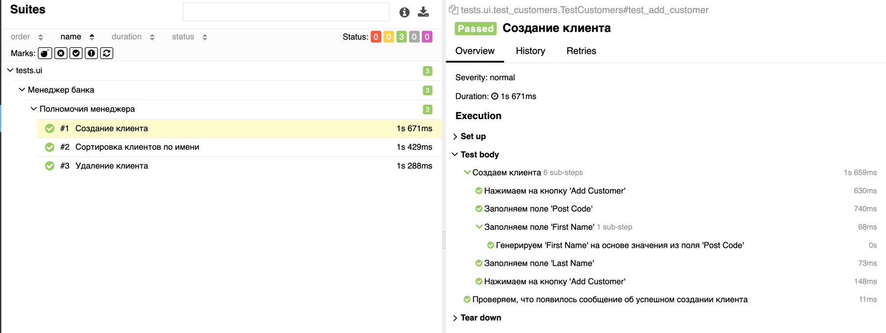

# Практикум SDET от компании Simbirsoft

## Подготовка проекта

1. #### Установить python 3.10
2. #### Активировать виртуальное окружение

3. #### Установить пакеты

```
pip install uv
uv pip install -r requirements.txt
```

## Задание UI

### Используемые технологии и инструменты

1) Python 3.10
2) Selenium Webdriver + Chrome
3) Webdriver manager
4) Тестовый фреймворк - PyTest
5) Паттерн проектирования Page Object Model
6) Формирования отчетов о пройденных тестах через Allure
7) Пакетный менеджер uv
8) Запуск тестов с помощью GitHub Actions при создании или обновлении pull request
9) Публикация результатов в GitHub Pages
10) pytest-xdist для запуска тестов в несколько потоков

### Запуск UI автотестов локально (для MacOs)

* Запуск всех UI тестов

```
pytest tests/ui -v
```

* Запуск UI тестов в 3 потока

```
pytest tests/ui -v -n=3
```

* Запуск UI тестов в headless-режиме в несколько потоков

```
pytest tests/ui -v -n 3 --headless
```

* Запуск UI тестов с генерацией отчета в allure

```
pytest tests/ui -v --alluredir=allure_results

# запуск allure отчета локально
allure serve allure_results
```

### Отчет доступен по [ссылке]("https://sfz111.github.io/SimbirsoftTask/ui")

Пример отчета о прохождении теста



## Задание API

### Используемые технологии и инструменты

1) Python 3.10
2) Тестовый фреймворк - PyTest
3) pytest-xdist для запуска тестов в несколько потоков
4) requests для отправки запросов
5) pydantic для валидации схем
6) deepdiff для сравнения json-ов
7) Формирования отчетов о пройденных тестах через Allure
8) Пакетный менеджер uv
9) Запуск тестов с помощью GitHub Actions при создании или обновлении pull request
10) Публикация результатов в GitHub Pages

### Запуск API тестов локально

* Запуск всех api тестов в классе TestEntity

```
pytest -k "TestEntity" -v
```

* Запуск api тестов в 3 потоков

```
pytest -k "TestEntity" -v -n=3
```

* Запуск api тестов с генерацией отчета в allure

```
pytest -k "TestEntity" --alluredir=allure_results

# запуск allure отчета локально
allure serve allure_results
```

### Отчет доступен по [ссылке]("https://sfz111.github.io/SimbirsoftTask/api/")

Пример отчета о прохождении теста


